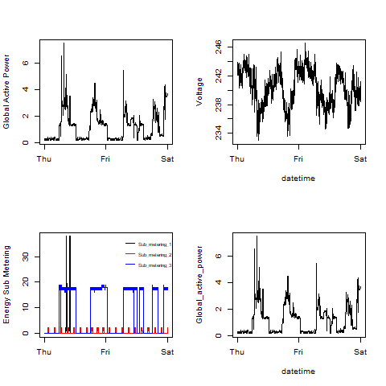

## Introduction

The repository that is given to fork and clone is:
[https://github.com/rdpeng/ExData_Plotting1](https://github.com/rdpeng/ExData_Plotting1)

* Added all the PNG files and R code files to the git repository

The constructed four plots are shown below. 

### Plot 1

 

### Plot 2

 

### Plot 3

 

### Plot 4

 

